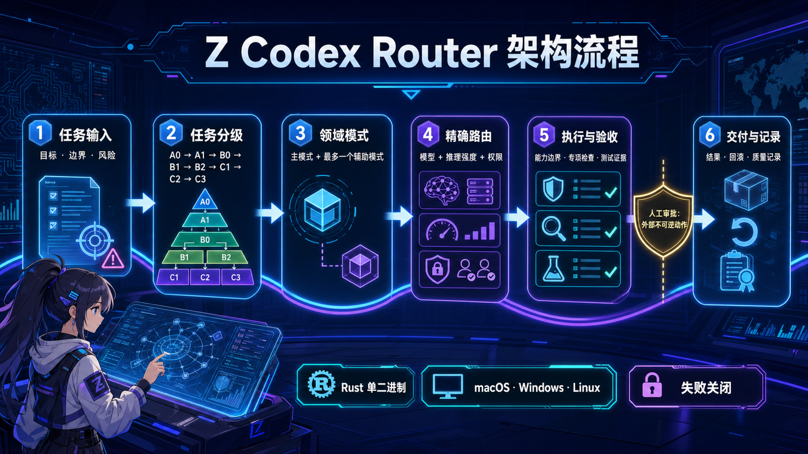
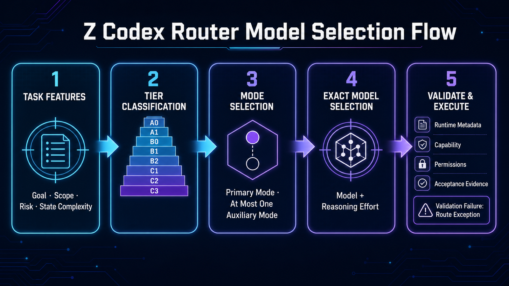

# Z Codex Router

[中文](#中文) · [English](#english)

**Choose the right model for every Codex task—exactly, audibly, and fail-closed.**

**为每个 Codex 任务精确选择正确模型：可审计、可升级、验证失败即停止。**

Version / 版本：`1.0.1`

## 中文

Z Codex Router 是一个 skills-only Codex 插件。把
`https://github.com/antonynz/z-codex-router` 发给具备终端、网络和写权限的 Agent，即可从
公开 GitHub Release 快速安装；无需 clone 仓库或下载其他平台包。

### 模型选择是核心

1. **先判 tier：** A0–C3 表达副作用、任务明确度、影响面、状态复杂度与风险。
2. **再选 mode：** Engineering、Product、Business Operations、Design、Testing 等 mode
   定义领域边界与验收证据。
3. **精确匹配：** profile 把 tier 映射到明确的 `(model, reasoning effort)`；运行时元数据、
   平台能力或精确组合无法验证时，报告 route exception，不猜默认值、不静默降级。
4. **可控升级：** stable profile 与 disabled candidate 分离；新模型只有在兼容性数据、显式
   mapping 和评估状态都通过后才会被有意启用。

### 把这些提示词发给 Agent

#### 安装并启用

> 请从 https://github.com/antonynz/z-codex-router 的公开 GitHub Release 安装并启用 Z Codex
> Router。不要要求我安装 CLI 或手工执行命令；不要 clone 仓库、不要使用 GitHub API；严格按 AGENT_INSTALL.md
> 自动识别当前平台，只下载一个匹配的预编译包和 SHA256SUMS，校验后安装到持久 source，
> 执行 dry-run、启用和 Doctor，并回报耗时、下载字节与结果。测试不得写真实 Codex home；如果
> 此会话只能安装插件或需要新会话，明确回报“已安装但未启用”及唯一下一步“调用 Enable Z Codex
> Router”。

#### 恢复或回滚

> 恢复 Z Codex Router。先运行 Doctor；若为 `E_TRANSACTION_PENDING`，运行 `recover` 恢复原
> 事务，再运行 Doctor。只操作受管块、payload 和状态，绝不覆盖我的其他 `AGENTS.md` 或
> `config.toml` 内容；哈希或用户修改冲突时停止。只有我明确要求回滚已完成的启用或升级时，才运行
> `rollback`。

#### 停用并卸载

> 停用并卸载 Z Codex Router。按固定顺序运行 Doctor → `uninstall` → Doctor，要求最终为
> `OK_NOT_ENABLED`；`uninstall` 必须先撤销精确受管块和状态、验证我的非受管内容不变、清理受管
> payload/备份/状态。任一冲突或失败都保留插件和可恢复控制面，绝不先删插件；仅在最终验收后执行
> `codex plugin remove z-codex-router@z-codex-router --json`。重复执行应安全，且不要删除整个
> `AGENTS.md` 或 `config.toml`。

普通“安装”只安装插件并执行 dry-run，不等于启用全局路由；只有明确“安装并启用”才会改变全局路由。

### 支持平台

| macOS | Linux | Windows |
| --- | --- | --- |
| arm64、Intel amd64 | arm64、x86_64 amd64 | arm64、x86_64 amd64 |

每个 tag 由对应架构的 GitHub hosted runner 原生构建并验证。macOS arm64 另有本地 release 与
隔离 lifecycle 实测。源码 checkout 故意不含二进制；可运行包位于 GitHub Releases。

### 详细文档

- [Agent 安装、权限、安全、缓存、恢复、升级、回滚与卸载协议](AGENT_INSTALL.md)
- [Router 架构](plugins/z-codex-router/core/router.md)
- [安全策略](SECURITY.md)
- [隐私](docs/privacy.md) · [条款](docs/terms.md) · [支持](docs/support.md)
- [变更记录](CHANGELOG.md)

本项目不是 OpenAI 官方产品，尚未提交或上架 OpenAI marketplace。Apache-2.0 licensed.

## English

Z Codex Router is a skills-only Codex plugin. Give
`https://github.com/antonynz/z-codex-router` to an Agent with terminal, network, and write access
to install quickly from a public GitHub Release—without cloning the repository or downloading
packages for other platforms.

### Model selection is the product

1. **Classify the tier:** A0–C3 captures side effects, task clarity, impact, state complexity, and
   risk.
2. **Choose the mode:** Engineering, Product, Business Operations, Design, Testing, and other modes
   define domain boundaries and acceptance evidence.
3. **Match exactly:** a profile maps each tier to an explicit `(model, reasoning effort)`. Missing
   runtime metadata, platform capability, or an exact match produces a route exception—never a
   guessed default or silent downgrade.
4. **Upgrade deliberately:** stable and disabled candidate profiles stay separate. A new model is
   enabled only after compatibility evidence, an explicit mapping, and evaluation state agree.

### Paste these prompts to an Agent

#### Install and enable

> Install and enable Z Codex Router from the public GitHub Release at
> https://github.com/antonynz/z-codex-router. Do not ask me to install a CLI or run commands;
> do not clone the repository or use the GitHub API. Follow AGENT_INSTALL.md exactly: detect this
> host, download only its one prebuilt
> package plus SHA256SUMS, verify it, install a persistent source, run dry-run, enable, and Doctor,
> then report elapsed time, downloaded bytes, and results. Never target my real Codex home in tests.
> If this session can only install the plugin or needs a new session, explicitly report “installed
> but not enabled” and the single next step: invoke Enable Z Codex Router.

#### Recover or roll back

> Recover Z Codex Router. Run Doctor first; if it returns `E_TRANSACTION_PENDING`, run `recover`
> to restore the original transaction, then run Doctor again. Touch only managed blocks, payload,
> and state; never overwrite my other `AGENTS.md` or `config.toml` content, and stop on a hash or
> user-change conflict. Run `rollback` only when I explicitly ask to undo a completed enablement
> or upgrade.

#### Disable and uninstall

> Disable and uninstall Z Codex Router. Use this exact order: Doctor → `uninstall` → Doctor and
> require final `OK_NOT_ENABLED`; `uninstall` must first revoke only the exact managed block and
> state, verify my unmanaged content is unchanged, and clean managed payload/backups/state. On any
> conflict or failure, retain the plugin and recoverable control plane—never remove the plugin
> first. Only after final acceptance run `codex plugin remove z-codex-router@z-codex-router --json`.
> It must be safe to repeat and must not delete my whole `AGENTS.md` or `config.toml`.

An ordinary “install” installs the plugin and performs a dry-run; it does not enable global routing.
Only explicit “install and enable” may change global routing.

### Supported platforms

| macOS | Linux | Windows |
| --- | --- | --- |
| arm64, Intel amd64 | arm64, x86_64 amd64 | arm64, x86_64 amd64 |

Each tag is built and validated on a native GitHub-hosted runner for its architecture. macOS arm64
also has a local release-build and isolated-lifecycle test. Source checkouts intentionally contain
no binary; runnable packages are published in GitHub Releases.

### Detailed documentation

- [Agent install, permissions, security, cache, recovery, upgrade, rollback, and uninstall protocol](AGENT_INSTALL.md)
- [Router architecture](plugins/z-codex-router/core/router.md)
- [Security policy](SECURITY.md)
- [Privacy](docs/privacy.md) · [Terms](docs/terms.md) · [Support](docs/support.md)
- [Changelog](CHANGELOG.md)

This is not an official OpenAI product and has not been submitted to or listed in the OpenAI
marketplace. Licensed under Apache-2.0.
